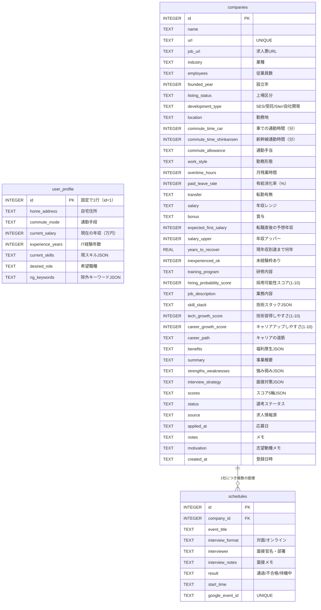

# データベース設計書

CareerSync AI — SQLite スキーマ定義

---

## ER図



---

## テーブル定義

### user_profile（ユーザー自身の情報・1行固定）

通勤時間算出・採用可能性スコア・年収回復年数などの**個人最適化分析**に使用する。

| カラム名 | 型 | 説明 |
|---|---|---|
| `id` | INTEGER PK | 常に1（1行固定） |
| `home_address` | TEXT | 自宅住所（例: 福島県郡山市字原中） |
| `commute_mode` | TEXT | `car`（高速可）/ `shinkansen`（手当支給時のみ） |
| `current_salary` | INTEGER | 現在の年収（万円）（例: 600） |
| `experience_years` | INTEGER | IT経験年数（未経験=0） |
| `current_skills` | TEXT | 習得済みスキルJSON |
| `desired_role` | TEXT | 希望職種（例: バックエンドエンジニア） |
| `ng_keywords` | TEXT | 除外キーワードJSON（例: `["SES","コールセンター"]`）|

**初期値（INSERT OR IGNORE で自動設定）:**
- home_address: 福島県郡山市字原中
- current_salary: 600万円
- desired_role: バックエンドエンジニア（自社開発・受託）
- ng_keywords: SES / コールセンター / 携帯販売 / テレアポ

---

### companies（企業情報・AI分析結果）

#### 企業基本情報（AIが自動抽出）

| カラム名 | 型 | 説明 |
|---|---|---|
| `id` | INTEGER PK | 自動採番 |
| `name` | TEXT | 企業名 |
| `url` | TEXT UNIQUE | 企業URL（重複登録防止） |
| `job_url` | TEXT | 求人票URL（企業サイトと別の場合） |
| `industry` | TEXT | 業種（例: SaaS / 製造業 / コンサル） |
| `employees` | TEXT | 従業員数（例: 500〜1000人） |
| `founded_year` | INTEGER | 設立年 |
| `listing_status` | TEXT | 上場区分（東証プライム / 東証グロース / 未上場） |
| `development_type` | TEXT | **SES / 受託 / SIer / 自社開発 / ハイブリッド** |

#### 勤務条件

| カラム名 | 型 | 説明 |
|---|---|---|
| `location` | TEXT | 勤務地（住所） |
| `commute_time_car` | INTEGER | 車での通勤時間（分）※Google Maps算出 |
| `commute_time_shinkansen` | INTEGER | 新幹線の通勤時間（分）※参考値 |
| `commute_allowance` | TEXT | 通勤手当（全額支給 / 上限◯円 / なし） |
| `work_style` | TEXT | 勤務形態（フルリモート / ハイブリッド / 出社） |
| `overtime_hours` | INTEGER | 月平均残業時間（時間） |
| `paid_leave_rate` | INTEGER | 有給消化率（%） |
| `transfer` | TEXT | 転勤（あり / なし / 相談可） |

#### 給与・賞与・年収シミュレーション

| カラム名 | 型 | 説明 |
|---|---|---|
| `salary` | TEXT | 年収レンジ（例: 350〜500万円） |
| `bonus` | TEXT | 賞与（例: 年2回・計4ヶ月分） |
| `expected_first_salary` | INTEGER | 転職直後の予想年収（万円）※AI推定 |
| `salary_upper` | INTEGER | 年収アッパー目安（万円）※AI推定 |
| `years_to_recover` | REAL | 現年収600万に近づく目安年数※AI算出 |

#### 未経験・採用可能性

| カラム名 | 型 | 説明 |
|---|---|---|
| `inexperienced_ok` | INTEGER | 未経験枠あり（1=あり / 0=なし） |
| `training_program` | TEXT | 研修内容・期間 |
| `hiring_probability_score` | INTEGER | 採用可能性スコア（1〜10）※AI推定 |

#### 技術・キャリア成長（スコア + テキスト）

| カラム名 | 型 | 説明 |
|---|---|---|
| `job_description` | TEXT | 具体的な業務内容 |
| `skill_stack` | TEXT | 使える技術スタック（JSON） |
| `tech_growth_score` | INTEGER | 技術を身につけられるか（1〜10） |
| `career_growth_score` | INTEGER | キャリアアップしやすいか（1〜10） |
| `career_path` | TEXT | キャリアの道筋（AI説明文） |

#### 福利厚生・AI分析（JSONテキスト）

| カラム名 | 型 | 説明 |
|---|---|---|
| `benefits` | TEXT | 福利厚生まとめ（JSON） |
| `summary` | TEXT | AI生成の事業概要 |
| `strengths_weaknesses` | TEXT | 強み・弱み（JSON） |
| `interview_strategy` | TEXT | 面接想定問答（JSON） |
| `scores` | TEXT | スコア5軸（JSON）※レーダーチャート用 |

#### scores JSONの構造

```json
{
  "growth": 8,
  "stability": 6,
  "culture_fit": 9,
  "work_life_balance": 7,
  "compensation": 5
}
```

#### 選考管理（ユーザー手動入力）

| カラム名 | 型 | 説明 |
|---|---|---|
| `status` | TEXT | 選考ステータス（検討中〜内定） |
| `source` | TEXT | 求人情報源（リクナビ / LinkedIn など） |
| `applied_at` | TEXT | 応募日 |
| `notes` | TEXT | 自由メモ |
| `motivation` | TEXT | 志望動機メモ（面接準備用） |
| `created_at` | TEXT | 登録日時（自動） |

#### status の取りうる値

```
検討中 → 書類応募 → 1次面接 → 2次面接 → 最終面接 → 内定 → 辞退
```

---

### schedules（面接スケジュール）

| カラム名 | 型 | 制約 | 説明 |
|---|---|---|---|
| `id` | INTEGER | PK | 自動採番 |
| `company_id` | INTEGER | FK, NOT NULL | companies.id 参照 |
| `event_title` | TEXT | NOT NULL | 例: 1次面接 |
| `interview_format` | TEXT | — | 対面 / オンライン |
| `interviewer` | TEXT | — | 面接官名・部署 |
| `interview_notes` | TEXT | — | 面接メモ（質問内容など） |
| `result` | TEXT | — | 通過 / 不合格 / 待機中 |
| `start_time` | TEXT | NOT NULL | ISO 8601形式 |
| `google_event_id` | TEXT | UNIQUE | カレンダーイベントID（手動登録時はNULL） |

---

## 設計上の判断メモ

### スコア設計の方針

数値スコアとテキストを両方持つことで、比較表でのソート（数値）と詳細表示（テキスト）を両立させる。

| スコア | 説明 | 算出主体 |
|---|---|---|
| `tech_growth_score` | 技術習得しやすさ（1〜10） | AI |
| `career_growth_score` | キャリアアップしやすさ（1〜10） | AI |
| `hiring_probability_score` | 採用可能性（1〜10） | AI（user_profileと照合） |
| `scores`（5軸） | 成長性・安定性・カルチャー・WLB・待遇 | AI |

### 通勤時間の算出方法

- `commute_time_car`: Google Maps Distance Matrix APIで郡山市字原中から自動計算（フェーズ2〜3で実装）
- `commute_time_shinkansen`: 新幹線ルートを計算するが、`commute_allowance`が「全額支給」または「上限金額以上」の場合のみUIに表示する

### ng_keywordsとdevelopment_typeの活用

AIが`development_type`を判定したとき、user_profileの`ng_keywords`（SES / コールセンターなど）に該当する場合は`hiring_probability_score`を自動で低評価（1〜3）に調整する。

### なぜJSONをTEXTで保存するか

SQLiteにはネイティブのJSON型がない。アプリ側（Python）でdict ↔ JSON文字列を変換する。
分析結果の構造が変わりやすいフィールド（strengths_weaknesses, benefits等）はJSONで柔軟に保持する。

### 外部キー制約

`connection.py`で`PRAGMA foreign_keys = ON`を設定。`company_id`は`ON DELETE CASCADE`なので企業削除時にスケジュールも自動削除される。
